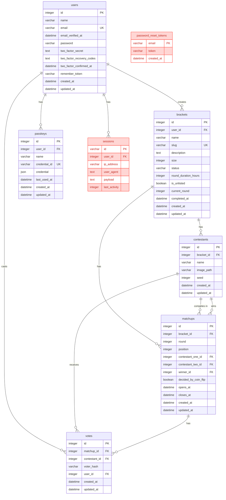

# Bracket Box

Community brackets decided one matchup at a time.

**PHP:** 8.4
**Laravel:** 13
**Node:** 22
**Asset Compiler:** Vite
**Database:** SQLite
**Frontend:** [Livewire v4](https://livewire.laravel.com/docs/quickstart)
**Testing:** [Pest v4](https://pestphp.com/docs/installation)

**Notable Composer Packages:**
- [larastan/larastan](https://github.com/larastan/larastan)
- [laravel/boost](https://github.com/laravel/boost)
- [laravel/chisel](https://github.com/laravel/chisel)
- [laravel/fortify](https://github.com/laravel/fortify)
- [laravel/pail](https://github.com/laravel/pail)
- [laravel/pao](https://github.com/laravel/pao)
- [league/flysystem-aws-s3-v3](https://github.com/thephpleague/flysystem-aws-s3-v3)
- [livewire/blaze](https://github.com/livewire/blaze)
- [livewire/flux](https://fluxui.dev/)
- [pestphp/pest-plugin-browser](https://pestphp.com/docs/browser-testing)

**Notable NPM Packages:**
- [@laravel/passkeys](https://www.npmjs.com/package/@laravel/passkeys)
- [playwright](https://github.com/microsoft/playwright)
- [tailwindcss](https://tailwindcss.com/)

### Helpful Commands

- `composer run setup`
    Sets up the repo for development by installing PHP dependencies, creating the `.env` file if missing, generating the app key, running database migrations, and installing and building the frontend assets with npm.

- `composer run dev`
    Runs multiple development tasks in parallel, including serving the site, running the queues, running `pail`, and compiling frontend assets.

- `composer run lint`
    Runs Pint to standardize the codebase.

- `composer run lint:check`
    Runs Pint in check-only mode, without applying fixes.

- `composer run ci:check`
    Runs all the commands that GitHub Actions will run, including Pint, PHPStan, and the test suite.

- `composer run types:check`
    Runs PHPStan to check the codebase for type safety.

- `composer run test`
    Runs Pint, PHPStan, and the test suite.

## ERD

| Color | Meaning |
| --- | --- |
| Blue | Application tables |
| Red Orange | Laravel default tables |

